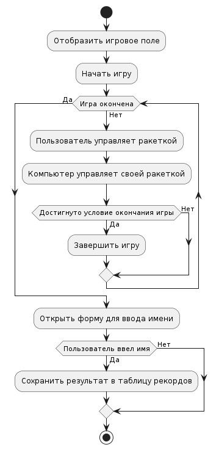

# Функциональные модели

## Диаграмма вариантов использования приложения
* [оффлайн файл](diagrams/application-diagramm.puml)

## Выбор режима игры и типа игры:

 **Пользователь выбирает режим игры и тип игры** 

- Пользователь делает клик по кнопке "Выбрать режим" в графическом интерфейсе игры.
- Приложение отображает форму с двумя вариантами режимов игры: "Против компьютера" и "Против другого пользователя".
- Пользователь выбирает один из режимов.
- После выбора режима игры, приложение предоставляет пользователю возможность выбрать тип игры: "По времени" или "По достижению определенного счёта".
- Пользователь выбирает один из типов игры в графическом интерфейсе.

* [оффлайн файл](diagrams/change-mode.puml)

## Запуск игры против компьютера:

 *Пользователь играет против компьютера* 

- Пользователь нажимает кнопку "Играть одному" в графическом интерфейсе.
- Приложение отображает игровое поле с ракетками пользователя и компьютера.
- Пользователь управляет своей ракеткой с помощью клавиш "Up" и "Down" на клавиатуре.
- Игра продолжается в соответствии с выбранным режимом игры (по времени или до достижения определенного счёта).
- По окончании игры пользователю предлагается внести свой результат в таблицу рекордов.

* [оффлайн файл](diagrams/game-vs-pc.puml)

## Запуск игры против другого пользователя:

 *Пользователь играет против другого пользователя* 

- Пользователь нажимает кнопку "Играть вдвоём" в графическом интерфейсе.
- Приложение отображает игровое поле с ракетками для двух игроков.
- Первый игрок управляет своей ракеткой с помощью клавиш "W" и "S" на клавиатуре, второй игрок - с помощью клавиш "Up" и "Down".
- Игра продолжается в соответствии с выбранным режимом игры (по времени или до достижения определенного счёта).
- По окончании игры "победитель" может внести свой результат в таблицу рекордов.

* [оффлайн файл](diagrams/game-vs-user.puml)

## Сохранение результата в таблицу рекордов:

 *Пользователь сохраняет результат в таблицу рекордов* 

- По окончании игры на экране появляется форма с запросом имени пользователя.
- Пользователь вводит свое имя в соответствующее поле формы.
- Пользователь нажимает кнопку "OK" для подтверждения внесения результата в таблицу рекордов.
- Результат игры с именем пользователя добавляется в таблицу рекордов.

* [оффлайн файл](diagrams/save-result.puml)

## Отображение таблицы рекордов на экране:

 *Пользователь просматривает таблицу рекордов* 

- Пользователь нажимает кнопку "Таблица рекордов" в графическом интерфейсе игры.
- Приложение отображает таблицу рекордов в виде двух отсортированных таблиц для каждого из типов игры(по времени/ по счёту).
- Пользователь может просматривать результаты других игроков на экране.

* [оффлайн файл](diagrams/show-result.puml)

